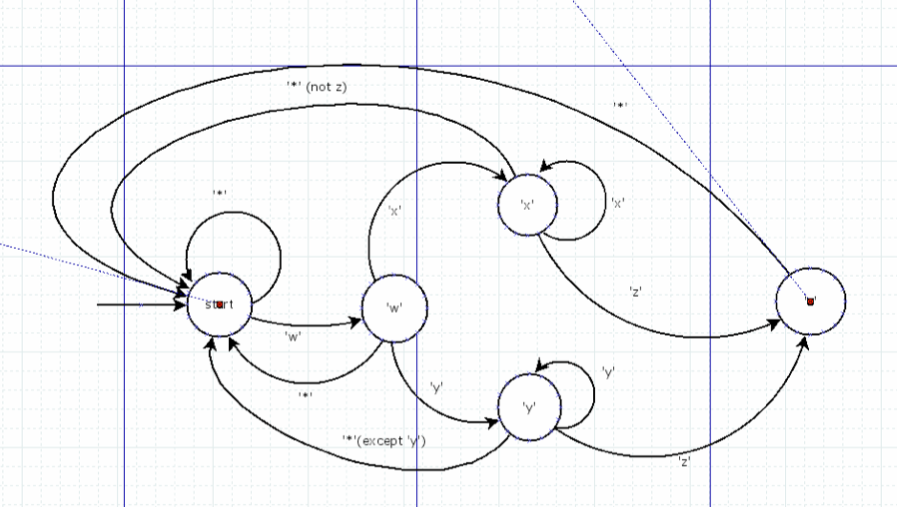

# Machine State

#### Regex Match Machine State Diagram

### Using machine state to match a pattern 

Iterate over a string of text and find a match

#### Credits

Michael Muse <mmuse@rentpath.com>
  
Andres Cubillos <acubillos@rentpath.com>.

